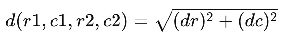
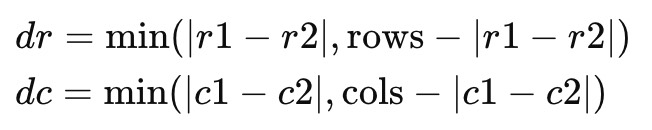
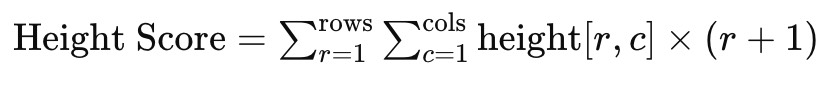
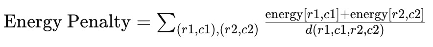
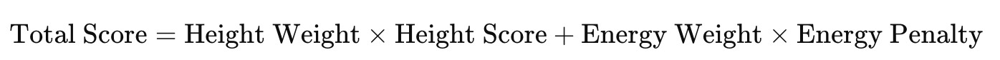
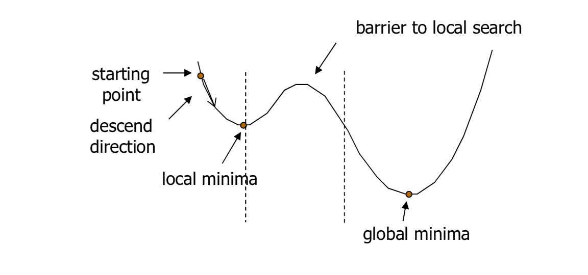

模拟退火算法是一种用于全局优化问题的概率性算法，特别适用于解决大规模组合优化问题。该算法基于物理退火过程，通过模拟物质从高温冷却到低温的过程来寻找全局最优解。。

## 算法步骤

### 1. 数据初始化

首先，我们从 Excel 文件中读取学生数据，包括姓名、身高和活跃度，并将这些数据存储在一个列表中。然后，根据座位的行数和列数将学生数据初始化为一个座位矩阵。如果学生人数不足，则用空数据补齐。

### 2. 座位矩阵初始化

将学生数据重新排列为一个矩阵，每个矩阵元素表示一个学生及其属性（姓名、身高、活跃度）。这样可以便于后续计算和优化。

### 3. 几何距离计算

为了计算每个座位之间的几何距离，我们使用以下公式：

其中：

这包括了环绕逻辑，即最左侧和最右侧座位之间的距离也视为1。

### 4. 目标函数计算

目标函数综合考虑以下因素：

- **身高分数**：希望身高较低的学生坐在前排。身高得分公式如下：

- **活跃度惩罚**：避免高活跃度的学生相邻。计算每对相邻（包括斜对角和环绕逻辑）的学生之间的活跃度总和，并根据几何距离进行加权惩罚。活跃度惩罚公式如下：

总得分公式：

### 5. 模拟退火算法

模拟退火算法通过以下步骤进行优化：

1. **初始解生成**：随机生成一个初始座位排列。
2. **邻域搜索**：在当前座位排列的邻域内随机选择两个座位进行交换，生成一个新解。
3. **接受准则**：根据当前温度和新解的得分决定是否接受新解。如果新解得分更低，直接接受；否则，以一定概率接受，概率与温度和得分差有关。
4. **降温过程**：逐步降低温度，使得算法逐步从广泛搜索收敛到局部精细搜索，最终找到全局最优解。

### 6. 算法整体流程

1. **读取数据**：从Excel文件中读取学生数据。
2. **初始化座位矩阵**：将学生数据初始化为座位矩阵。
3. **计算几何距离**：计算学生座位之间的几何距离，包括环绕逻辑。
4. **计算目标函数**：根据学生的身高和活跃度计算目标函数得分。
5. **模拟退火优化**：通过模拟退火算法优化座位排列，逐步找到最优解。

## 总结

通过以上步骤，模拟退火算法可以有效地优化学生座位排列，使得身高较低的学生坐在前排，并避免高活跃度的学生相邻。这样既能满足课堂管理的需求，又能提高学生的学习效率和舒适度。
